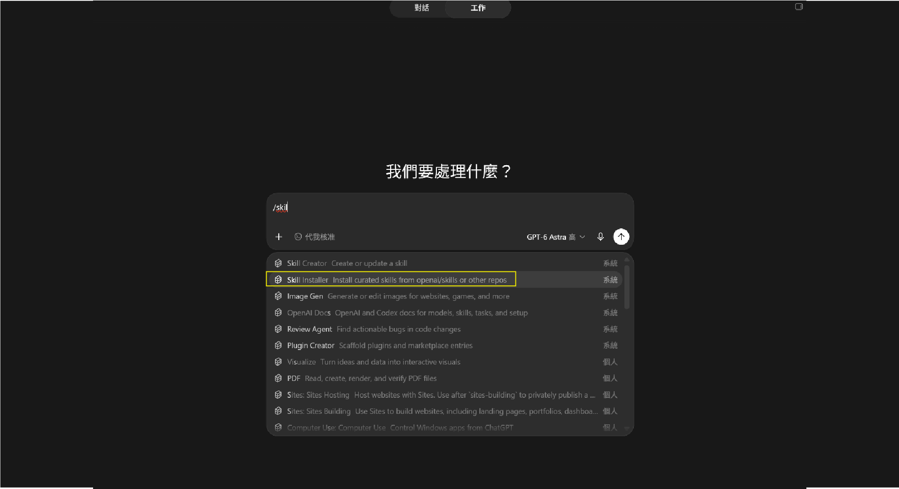
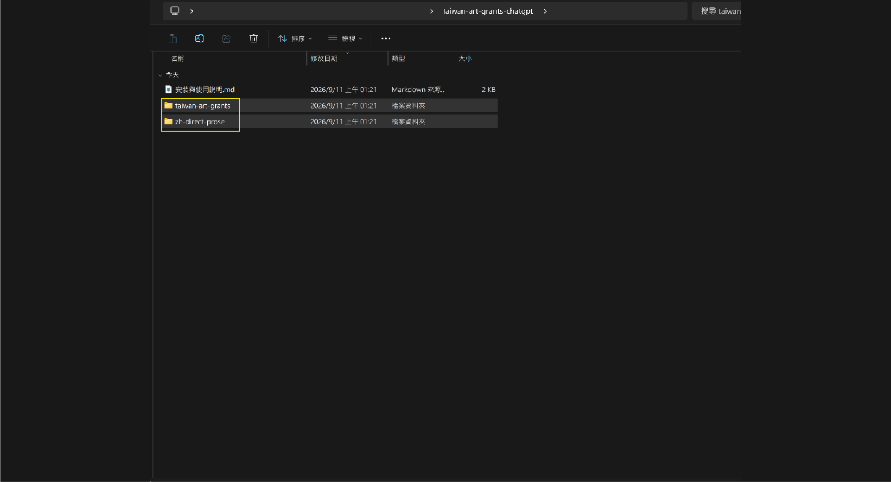
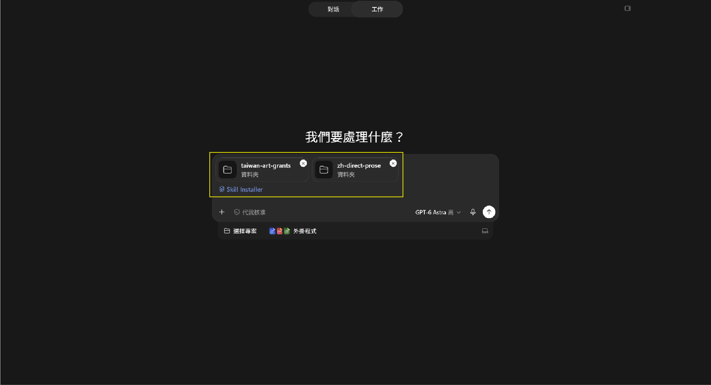
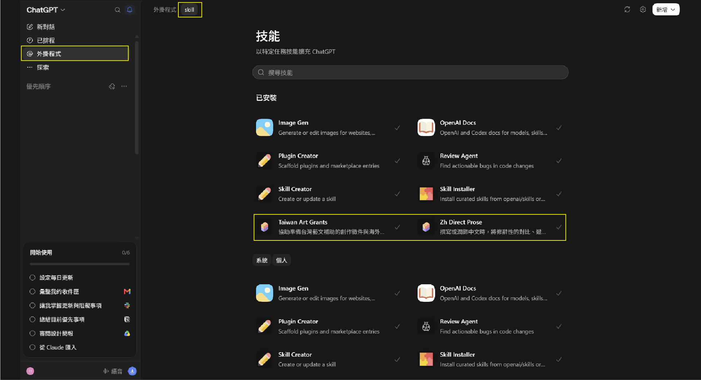
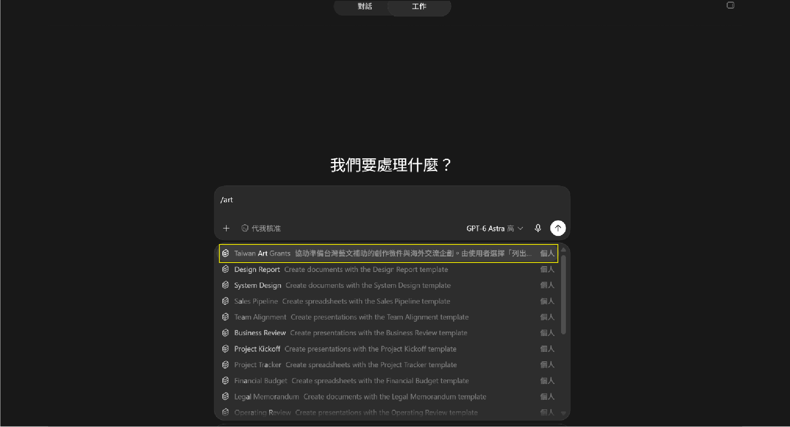
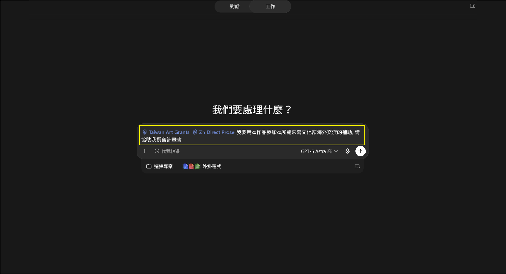

# ChatGPT：安裝與開始使用

先在電腦下載 ChatGPT 分享包，解壓一次。以下依 ChatGPT 桌面版的「工作」模式示範，需能使用 Skill Installer 並存取拖入的資料夾。

## 1. 選取 Skill Installer

開啟新對話，切換到上方的 **工作**。
在輸入框輸入 `/skill`，從清單點選 **Skill Installer**。

## 2. 找到兩個技能資料夾

打開解壓後的分享包，找到：

- **`taiwan-art-grants`**：企劃寫作助手。
- **`zh-direct-prose`**：中文修飾助手。

選取這兩個完整資料夾，保留裡面的指令與參考資料。
分享包另附 `images` 教學圖片資料夾，留著看教學即可，不用拖入安裝。

## 3. 拖入對話，請它安裝

把兩個資料夾拖進剛才的輸入框。確認畫面同時出現 **兩個資料夾**和 **Skill Installer**，再輸入：

> 請將這兩個資料夾安裝為獨立 Skills，保留完整指令與參考資料。完成後，請確認兩個技能都可以使用。

按送出，依畫面完成必要的資料夾存取授權，等候安裝完成。

## 4. 確認安裝成功

點左側 **外掛程式**，再切換上方的 **skill** 分頁。
在「已安裝」看到以下兩項，就代表已加入：

- **Taiwan Art Grants**：企劃寫作助手。
- **Zh Direct Prose**：中文修飾助手。

## 5. 在新對話選用兩個助手

開啟新的「工作」對話，在輸入框輸入 `/art`，選擇 **Taiwan Art Grants**。
接著輸入 `/zh`，再選擇 **Zh Direct Prose**。

## 6. 告訴它你要申請什麼

確認兩個助手名稱都出現在輸入框，再加入補助簡章、作品資料和邀請函（如果有）。例如：

> 我要用《XX作品》參加 XX 影展，準備申請海外交流補助。請依照我提供的簡章和資料，協助整理企劃書，缺少的資料先標出來。

把 XX 換成自己的作品與影展名稱，按送出即可。創作徵件也可以直接說明想申請的項目。

你也可以接著指定寫法：

- **想自己寫：**「請先列出每段的用途和一句話重點，我會自己擴寫。」
- **想先看草稿：**「請先寫出內文，我再修改。」

需要 Word 時，再說：

> 請核對前後的人員、日期、行程與預算是否一致，再把目前完成的內容整理成可編輯的 Word，未完成的部分標示待補。

Word 輸出需要目前環境具備文件製作功能。下載後，開啟檔案確認內容、表格與版面，再補齊申請資料。
